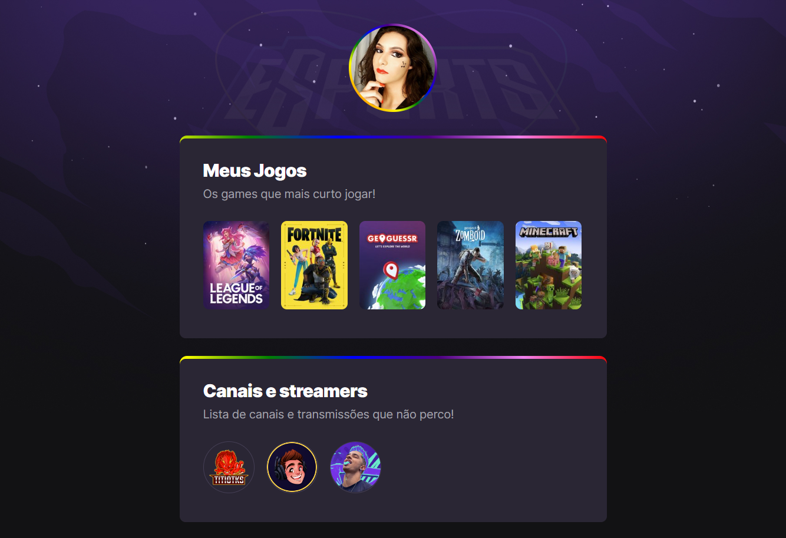

<h1 align="center">NLW E-Sport</h1>

Project built from Rocketseat's next level week event.

## 💻 Project
 

 
This is my first project and basically it is a layout of my favorite games, streamers and some social networks.The project is basically developed in HTML5 and CSS3. Where onclick is possible to access the game page on twitch, the same goes for pressing on streamers and social media.

[🔗 Click here to access](https://manuelaalecio.github.io/nlw-esports-explore/)

## 🔨 Technologies

- HTML5
- CSS3
- Git e GitHub

## 📫 Contact

manuelaalecio.dev@gmail.com